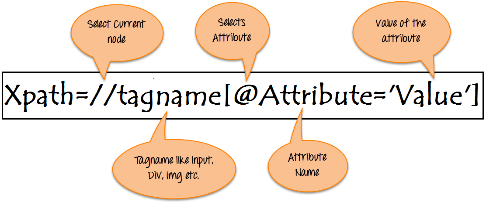

# What is Selenium?

Selenium is a free (open-source) automated testing framework used to validate web applications across different browsers
and platforms. You can use multiple programming languages like Java, C#, Python etc. to create Selenium Test Scripts.
Testing done using the Selenium testing tool is usually referred to as Selenium Testing.

# How can we use Selenium in Automation?

Selenium WebDriver is used to automate web application testing to verify that it works as expected. It supports many
browsers such as Firefox, Chrome, Opera, Safari, etc. In order to execute your test on Google Chrome browser, you need
to download the chrome driver and set it up in your project. If you want to execute your test on other browsers you
will, of course, need the corresponding drivers.

# What are the use cases?

We're using Selenium on most of our applications which are Web UI based. It's a great tool as it's open source and
supports multi browsers including headless browsers.

Web-based application automation are mostly done using Selenium. It's the right automation tool as a replacement for
manual regression testing that indispensably reduces the testing time due to its cross-browser, parallel, and remote
executions.

Selenium is being used across multiple teams within our Engineering department. Easy to use Test Automation Tool:
We mainly use Selenium to run some automated test cases. Since it doesn't have platform dependency and does not really
require learning new languages, it gives us lot of flexibility in usage. It can be easily integrated with various
development platforms such as Jenkins, Maven, etc.

# Short Description
This template will run your Youtube website and search for Knoldus Inc channel and run the first video from there.

# Steps to run the file
Step 1: Download or Clone the repo in your System.

Step 2: Open the project in IntelliJ or any IDE which can run maven projects.

Step 3: Go to `src > test > java > SearchOnYoutubeTest` and Run the Test. 

Note:-
If the file doesn't get the test annotation , first build the project in Intellij.
If the chromedriver version error occur kindly update the chrome-driver in `src > main > resources > chromedriver`
as per your chrome-browser version, from this link:- https://chromedriver.chromium.org/downloads 
Currently, this project has `Chrome version 95, with ChromeDriver 95.0.4638.69`

# Tips to find How Xpath works

How to find the Xpath :-

Step 1: Inspect the page , ctrl+shift+I or right click from mouse and select Inspect option.

Step 2: Then, select the particular element you want to use.

for example:-

See this picture to make a simple xpath from the HTML DOM.

Real Example , making of a xpath:-

---
